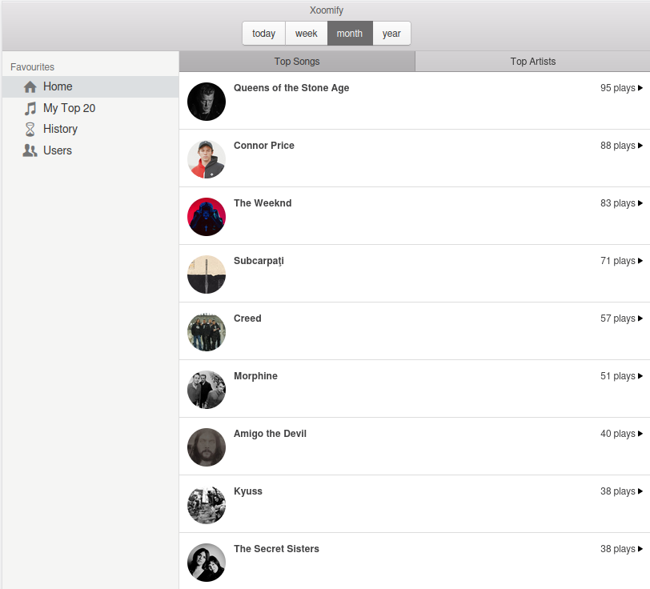

# Xoomify

See what you and your friends are listening to on Spotify.



## Install

### Configure

Go to [Spotify's Developer Portal](https://developer.spotify.com/dashboard) and create an app.

Set `Redirect URI` to `http://localhost:8000`

Get client ID and secret.

```sh
mv .env .env.bak
./configure.sh
```

Database credentials will be genrated and you will be asked for Spotify App configuration.

### Start

```sh
docker build -t local/xoomify:latest .
docker-compose up -d
```

Create database schema:

```sh
docker exec -it ${APP_CONTAINER_ID} php /var/www/bin/console doctrine:migrations:migrate
```

visit [http://localhost:8000](http://localhost:8000) in your browser.

The default cron job to update user play history runs every 10 minutes (check [docker-compose.yaml](./docker-compose.yaml) ).


## Dev setup

### Requirements

- [php 8.2](https://www.php.net/releases/8.2/en.php)
- [composer](https://getcomposer.org/)
- [symfony cli](https://symfony.com/download)
- [nodejs + npm](https://nodejs.org/en)

### Install dependencies

```sh
composer install
npm install
```

### Run database migrations

```sh
php bin/console doctrine:migrations:migrate
```

### Development run

```sh
npm run watch
symfony server:start --no-tls
```

### Run tests

```sh
composer test
```
